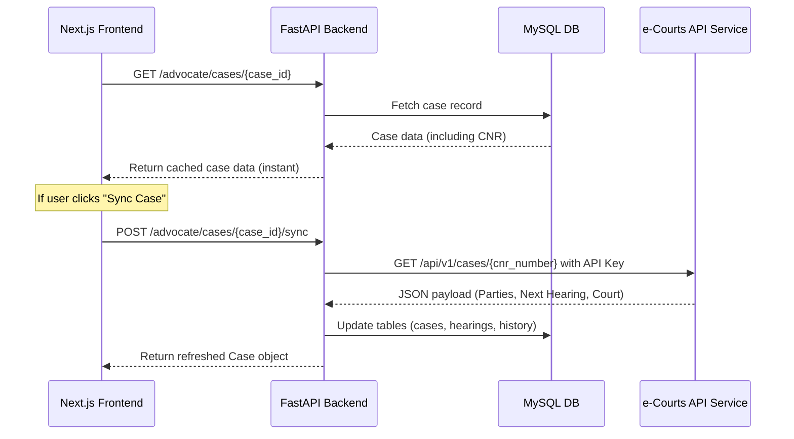

# e-Courts India API: Frontend-Backend Integration Plan

This document outlines the implementation plan for integrating e-Courts India case data into the Legal Tech platform. Integrating the e-Courts API allows the application to replace mock case data with real-time updates for case progress, next hearing dates, court venues, and judge assignments.

---

## 1. Core Concepts & API Selection

The official government e-Courts portal ([services.ecourts.gov.in](https://services.ecourts.gov.in/)) does not provide a direct, free public REST API with OAuth/API keys for external developers. Thus, integration must utilize either:
1. **Third-Party Legal-Data APIs (Recommended)**: Aggregate feeds (e.g., Vakilsearch APIs, LegalKart, Legitquest) which offer clean JSON endpoints queried by **CNR (Case Number Record)**.
2. **Custom scraping / Headless browsers**: Running background scraping jobs solving CAPTCHAs via OCR (high latency, fragile to e-Courts DOM changes).

### Case Identification: The CNR Number
All e-Courts integrations rely on the **CNR Number** — a unique 16-character alphanumeric code assigned to every case in District/High Courts.
- Format: `[State Code (2)][District Code (2)][Court Complex Code (2)][Filing Number (6)][Filing Year (4)]`
- Example: `MHPU01-001234-2023` (Maharashtra, Pune, Court Complex 01, Case No. 1234, Year 2023).

---

## 2. Integration Architecture

To avoid rate limits and minimize latency, the backend behaves as a caching proxy gateway:



---

## 3. Database Schema Modifications (Backend)

The backend schema will be enhanced to support CNR number indexing, sync tracking, and detailed history.

```python
# Proposed schema additions inside app/advocate/case_management/models.py

class Case(Base):
    __tablename__ = "cases"

    id = Column(Integer, primary_key=True, index=True)
    case_number = Column(String(100), unique=True, index=True) # User-defined case ID
    
    # --- New e-Courts Integration Fields ---
    cnr_number = Column(String(20), unique=True, index=True, nullable=True) # Unique 16-character CNR
    is_ecourts_synced = Column(Boolean, default=False)
    last_synced_at = Column(DateTime, nullable=True)
    
    # Extracted fields from e-Courts payload
    petitioner = Column(String(255), nullable=True)
    respondent = Column(String(255), nullable=True)
    court_name = Column(String(255), nullable=True)
    judge_name = Column(String(255), nullable=True)
    case_type = Column(String(100), nullable=True) # e.g. Criminal Appeal (CA)
    filing_date = Column(Date, nullable=True)
    
    # State fields
    status = Column(String(50), default="Active") # Active, Hearing, Disposed, Pending
    next_hearing_date = Column(Date, nullable=True)
    next_hearing_purpose = Column(String(255), nullable=True)
```

---

## 4. Backend Implementation Plan (FastAPI)

### Step 4.1: Add API client wrapper (`app/core/ecourts_client.py`)
Implement an asynchronous client wrapper utilizing standard environments.

```python
import httpx
from os import getenv

ECOURTS_API_URL = getenv("ECOURTS_API_URL", "https://api.thirdpartyprovider.com/v1")
ECOURTS_API_KEY = getenv("ECOURTS_API_KEY")

async def fetch_case_by_cnr(cnr_number: str) -> dict:
    """Queries external e-Courts provider for details of a CNR number."""
    if not ECOURTS_API_KEY:
        raise ValueError("e-Courts API configuration is missing")
        
    headers = {"Authorization": f"Bearer {ECOURTS_API_KEY}"}
    async with httpx.AsyncClient() as client:
        response = await client.get(
            f"{ECOURTS_API_URL}/case/cnr/{cnr_number}",
            headers=headers,
            timeout=15.0
        )
        if response.status_code == 200:
            return response.json()
        elif response.status_code == 404:
            return None
        else:
            response.raise_for_status()
```

### Step 4.2: Add Case Management Routers (`app/advocate/case_management/routes.py`)
Add routes to retrieve real-time data dynamically:

*   **GET `/advocate/cases/fetch-cnr/{cnr}`**
    *   **Description**: Pulls live case data for validation before saving the new case database record.
    *   **Response (200)**: returns standard JSON mappings of case title, court, and hearings list.
*   **POST `/advocate/cases/{case_id}/sync`**
    *   **Description**: Manually updates a single case with the latest e-Courts registry file.
    *   **Response (200)**: `{ "status": "success", "last_synced_at": "...", "updated_fields": ["next_hearing_date", "status"] }`

### Step 4.3: Daily Cron Job Synchronization (Optional)
Using standard scheduler loops, query database entries having active `cnr_number` values and pull changes nightly to keep the calendar entries and notifications up to date.

---

## 5. Frontend Integration Plan (Next.js)

### Step 5.1: Update "Add Case Form" (`pages/UI/CaseManagement/AddCaseForm.jsx`)
Instead of manual typing of all details (title, court, client), add a "Fetch from e-Courts" helper flow:

```jsx
// Form field additions
const handleCnrLookup = async (cnr) => {
  setLoading(true);
  try {
    const res = await fetch(`http://localhost:8000/advocate/cases/fetch-cnr/${cnr}`);
    if (res.ok) {
      const data = await res.json();
      // Auto-fill fields
      setFormData({
        ...formData,
        title: `${data.petitioner} vs. ${data.respondent}`,
        court: data.court_name,
        judge: data.judge_name,
        type: data.case_type,
        next_hearing_date: data.next_hearing_date,
      });
    }
  } catch (err) {
    alert("CNR Lookup failed. Please check connection/number.");
  } finally {
    setLoading(false);
  }
};
```

### Step 5.2: Update Cases List (`pages/UI/CaseManagement/CaseView.jsx`)
- Render a `⚡ Synced` badge next to cases that have a verified CNR number.
- Add a "Sync Now" button inside the actions row that updates the table rows without refreshing the webpage.
- Automatically link case hearing changes directly to notifications (`notifications/`) to notify advocates when next hearings are rescheduled.
